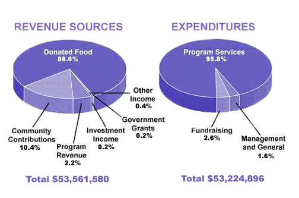

## 题目

You should spend about 20 minutes on this task.

**The pie chart shows the amount of money that a children's charity located in the USA spent and received in one year, 2016.**

Summarise the information by selecting and reporting the main features and make comparisons where relevant.

Write at least 150 words.

## 原文

The chart illustrates the revenue sources and expenditures of a USA charity in 2016.

This year, the charity spent a total of 53 million US dollars and generated slightly more income. 

Now comes to the revenues, the main income source of the charity is "Donated Food", which takes up 86.6% percent of the total revenue. The second and third largest income sources are "Community Contributors" and "Program Revenue", from which they got 12.6% percent of total income. Other small income sources including "Investment Income", "Government Grants" and "Other Income" only contribute to 0.8 percent of the gross revenue.

As for the expenditures, "Program Services", where most of the expenditures goes, takes 95.8% of the total spendings. The maintaining Fee of the charity, which are listed as "Fundraising" and "Management and General", eats up a total of 4.2% from the expenditures.

From the data, most of the donations have been put into use for real Charity, instead of being wasted in simply running the charity, which is fantastic.

## 评分

To evaluate this IELTS Writing Task 1 response, I will consider the four criteria used by IELTS examiners: Task Achievement, Coherence and Cohesion, Lexical Resource, and Grammatical Range and Accuracy.

1. **Task Achievement**: The candidate addresses the requirements of the task. They summarise the main features of the pie charts by discussing the proportions of revenue sources and expenditures. However, the candidate could improve by providing more detailed comparisons and specific figures to enhance the report.

2. **Coherence and Cohesion**: The response is logically organised, with clear overall summaries of revenue and expenditure. The writer uses cohesive devices such as "Now comes to the revenues" and "As for the expenditures." However, there is room for improvement in the coherence of the text, as some transitions between ideas are abrupt.

3. **Lexical Resource**: The candidate uses a range of vocabulary to describe the pie charts, such as "revenue sources," "expenditures," "Program Services," and "Community Contributors." However, there are minor errors like "takes up 86.6% percent" where "percent" is redundant after the percentage symbol.

4. **Grammatical Range and Accuracy**: The response has a mix of simple and complex sentence structures. There are some grammatical errors such as "where most of the expenditures goes" which should be "go," and "eats up a total of 4.2% from the expenditures" could be more accurately expressed.

The final comment "which is fantastic" is subjective and not usually appropriate for a task 1 response, which should maintain an objective tone.

Based on these criteria, the response would likely score in the band 5 to 6 range. To achieve a higher score, the candidate should include more specific data, avoid redundancy and subjective language, improve the accuracy of language use, and ensure a clear, logical progression of information.

Regarding the pie charts provided, the response accurately reflects the data shown, but including more specific figures could enhance the report. For instance, mentioning the actual amounts for "Community Contributors" and "Program Revenue" in addition to their percentages would align with the level of detail expected in a higher-scoring response.

## 修改

The pie chart provides a breakdown of the income sources and expenditures for a children's charity in the USA for the year 2016.

In terms of revenue, the charity amassed $53,561,580, with the lion's share coming from donated food, accounting for an overwhelming 86.6% of the total. Community contributions formed the second-largest segment at 10.4%, followed by program revenue at 2.2%. Other minor sources, including investment income (0.2%), government grants (0.2%), and miscellaneous income (0.4%), made up the remainder.

On the expenditure side, the charity reported total spending of $53,224,896, with the vast majority, 95.8%, allocated to program services. This demonstrates a strong commitment to their core mission. Fundraising costs accounted for 2.6% of the outlay, while management and general expenses represented a modest 1.6%.

The data indicates a commendable fiscal approach, with a significant portion of funds being channeled directly into program services. It is notable that the income slightly exceeded the expenditures, suggesting efficient financial management. To further enhance transparency, future reports could benefit from including the absolute figures for smaller categories of revenue and expenses, providing a more comprehensive financial picture.

In summary, the charity's emphasis on directing funds towards program services is evident, with minimal resources being utilized for administrative costs, illustrating a focused application of donor contributions towards its charitable activities.

